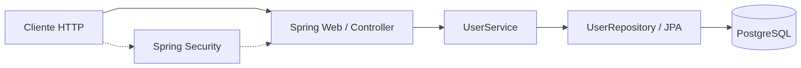

# Projeto: Restaurant Manager

## Introdução

### Descrição do problema
Na nossa região, um grupo de restaurantes decidiu contratar estudantes
para construir um sistema de gestão para seus estabelecimentos. Essa decisão
foi motivada pelo alto custo de sistemas individuais, o que levou os
restaurantes a se unirem para desenvolver um sistema único e compartilhado.
Esse sistema permitirá que os clientes escolham restaurantes com base na
comida oferecida, em vez de se basearem na qualidade do sistema de gestão.
O objetivo é criar um sistema robusto que permita a todos os
restaurantes gerenciar eficientemente suas operações, enquanto os clientes
poderão consultar informações, deixar avaliações e fazer pedidos online.
Devido à limitação de recursos financeiros, foi acordado que a entrega do
sistema será realizada em fases, garantindo que cada etapa seja desenvolvida
de forma cuidadosa e eficaz.
A divisão em fases possibilitará uma implementação gradual e
controlada, permitindo ajustes e melhorias contínuas conforme o sistema for
sendo utilizado e avaliado tanto pelos restaurantes quanto pelos clientes.

### Objetivo do projeto
Desenvolver um backend completo e robusto utilizando Spring Boot e os princípios aprendidos na Fase 1 do curso.
O sistema deve permitir:
- Cadastro, atualização e exclusão de usuários;
- Troca de senha do usuário em endpoint separado;
- Atualização das demais informações do usuário em endpoint distinto do endpoint de senha;
- Registro da data da última alteração;
- Busca de usuários pelo nome;
- Garantia de que o e-mail cadastrado seja único;
- Validação de login obrigatória, por meio de um serviço que verifique se login e senha são válidos:
  - Não é obrigatório utilizar Spring Security;
  - Pode ser utilizada uma validação simples consultando os dados no banco.
  
A aplicação deverá ser dockerizada, utilizando Docker Compose para orquestração junto com um banco de dados relacional (MySQL ou
PostgreSQL).

## Arquitetura do Sistema

### Descrição da Arquitetura
O código foi organizado nos pacotes `config`, `controller`, `domain` e `infra`.

No pacote `config` ficam classes comuns à API, em especial o `@ControllerAdvice`
(`CustomExceptionHandler`) que traduz exceções em respostas HTTP com `ProblemDetail` (RFC 7807).

No pacote `controller` ficam os endpoints REST: mapeamento HTTP, validação de entrada com
`@Valid` onde aplicável e delegação das regras de negócio ao serviço, sem acesso direto ao
repositório (`UserRepository` e `User`).

No pacote `domain` concentram-se o caso de uso de usuário (`UserService`), o acesso a dados
(`UserRepository` / Spring Data JPA), a entidade `User`, DTOs de entrada e saída (records) e
tipos como o enum `Profile`.

No pacote `infra` ficam integrações de infraestrutura, como a configuração do Spring Security
(`SecurityConfigs`), separada da regra de negócio.

### Diagrama da Arquitetura



## Descrição dos Endpoints da API

| Endpoint                 | Método | Descrição                                  |
|--------------------------|--------|--------------------------------------------|
| /v1/user/change-password | POST   | Altera a senha do usuário                  |
| /v1/user/valid           | POST   | Valida se o login de autenticação é valido |
| /v1/user                 | POST   | Cria um usuário novo                       |
| /v1/user/{id}            | PATCH  | Atualiza parcialmente os dados do usuário  |
| /v1/user/{id}            | DELETE | Deleta um usuário                          |
| /v1/user                 | GET    | Busca o usuário de acordo com seu nome     |

### Exemplos de requisições e respostas

Base da API: `http://localhost:8080`.  
Respostas de erro seguem **`ProblemDetail`** (JSON com campos como `type`, `title`, `status`, `detail`), conforme `CustomExceptionHandler`.

#### POST `/v1/user` — criar usuário

`profile` aceita: `CLIENT`, `RESTAURANT_OWNER`, `ADMIN`.

```bash
curl -s -X POST http://localhost:8080/v1/user \
  -H "Content-Type: application/json" \
  -d '{
    "name": "Maria Silva",
    "email": "maria@example.com",
    "login": "maria",
    "password": "senhaSegura123",
    "address": "Rua A, 1",
    "profile": "CLIENT"
  }'
```

**Sucesso — `201 Created`** (corpo `UserResponse`):

```json
{
  "id": 1,
  "name": "Maria Silva",
  "email": "maria@example.com",
  "login": "maria",
  "lastUpdate": "2026-05-02T14:30:00",
  "address": "Rua A, 1"
}
```

**Erro — `400 Bad Request`**: validação de entrada (`@Valid`) ou violação de integridade (ex.: e-mail duplicado), com `ProblemDetail`.

#### POST `/v1/user/valid` — validar login

```bash
curl -s -i -X POST http://localhost:8080/v1/user/valid \
  -H "Content-Type: application/json" \
  -d '{ "email": "maria@example.com", "password": "senhaSegura123" }'
```

**Sucesso — `200 OK`**: corpo vazio (autenticação bem-sucedida).  
**Erro — `401 Unauthorized`**: credenciais inválidas (`ProblemDetail`).

#### POST `/v1/user/change-password` — alterar senha

```bash
curl -s -i -X POST http://localhost:8080/v1/user/change-password \
  -H "Content-Type: application/json" \
  -d '{
    "email": "maria@example.com",
    "password": "senhaSegura123",
    "newPassword": "outraSenha456"
  }'
```

**Sucesso — `204 No Content`**: sem corpo.  
**Erro — `400 Bad Request`**: senha atual incorreta; **`404 Not Found`**: usuário não encontrado (`ProblemDetail`).

#### PATCH `/v1/user/{id}` — atualização parcial

Campos opcionais no corpo: `name`, `email`, `login`, `address` (envie só o que deseja alterar).

```bash
curl -s -i -X PATCH http://localhost:8080/v1/user/1 \
  -H "Content-Type: application/json" \
  -d '{ "name": "Maria S.", "address": "Rua B, 2" }'
```

**Sucesso — `200 OK`**: corpo vazio.

#### GET `/v1/user?name=...` — buscar por nome

```bash
curl -s "http://localhost:8080/v1/user?name=Maria"
```

**Sucesso — `200 OK`**: lista de `UserResponse`.

```json
[
  {
    "id": 1,
    "name": "Maria Silva",
    "email": "maria@example.com",
    "login": "maria",
    "lastUpdate": "2026-05-02T14:30:00",
    "address": "Rua A, 1"
  }
]
```

#### DELETE `/v1/user/{id}` — excluir

Este endpoint exige **usuário autenticado** e papel **`RESTAURANT_OWNER`** ou **`ADMIN`** (`@PreAuthorize`). Exemplo com HTTP Basic (ajuste login e senha a um usuário existente com o papel necessário):

```bash
curl -s -i -X DELETE http://localhost:8080/v1/user/1 \
  -u "loginOuEmail:senha"
```

**Sucesso — `200 OK`**: corpo vazio.  
**Sem autenticação — `401 Unauthorized`**.  
**Autenticado sem permissão — `403 Forbidden`**.

## Configuração do Projeto

### Configuração do Docker Compose

Temos dois serviços em nosso `compose.yaml`, o serviço de `db` é o nosso banco de dados que tem a porta **7432** para acesso a ele mudada
devido a outros serviços que executo na minha máquina e tem um healthcheck para que o serviço de `app` posso aguardar o banco estar disponível.

### Instruções para execução local
Como estamos a usar o Spring boot 4 nesse projeto, e como existe em versões Spring boot 3+, o suporte ao docker compose 
vem nativo no Spring. Então se o docker estiver em execução, basta apenas executar a classe `TechChallengeRestaurantManagerApplication` para
ter a aplicação rodando.

## Qualidade do Código

### Boas Práticas Utilizadas
Foram seguidos os padrões de SOLID em algumas partes do projeto e alguns padrões do Spring boot. 
- Todas as classes foram pensadas para seguir o padrão de Single Responsibility Principle e ter somente uma função. Como podemos ver a separação de responsabilidades das classes em diferentes camadas.
- Foi versionada as rotas `v1/user`.
- O controller HTTP (UserController) delega regras ao UserService e persistência ao UserRepository. Separando assim as camadas de controller, serviço e a persistência.
- Anotações de validação em DTOs que fazem sentido, como por exemplo o `ChangeUserPasswordRequest` e sem validação para os casos que não faz sentido ter `UpdateUserRequest`.
- Erros HTTP padronizados na classe `CustomExceptionHandler`.
- Spring security no end point de delete
- OpenAPI/Swagger com uso de TAGs

## Collections para Teste

### Link para a Collection do Postman

https://github.com/filipehb/tech_challenge_restaurant_manager/blob/main/src/main/resources/postman/Scratch%20Pad.postman_collection.json

### Descrição dos Testes Manuais

Os testes foram pensados para serem executados em ordem, começando do teste "Create User" e finalizando com o teste "
Validate Login".
Essa ordem deve ser seguida e respeitada para ter o resultado esperado nos testes.

## Repositório do Código

https://github.com/filipehb/tech_challenge_restaurant_manager

